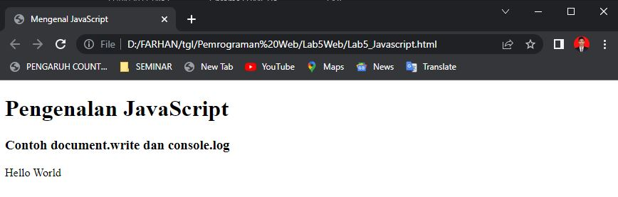
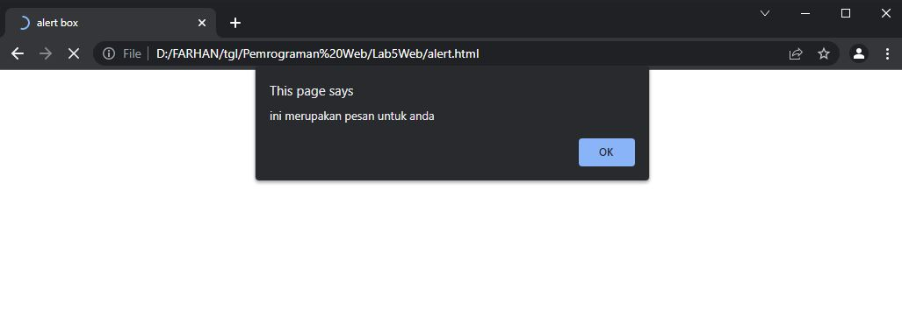
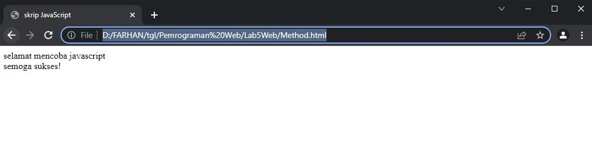
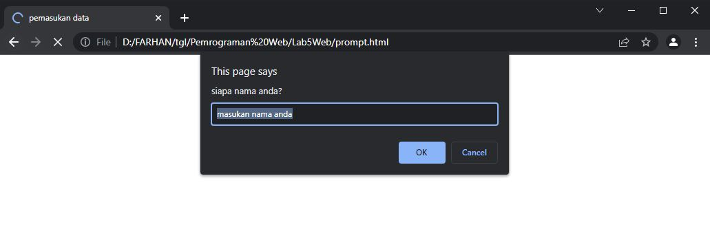
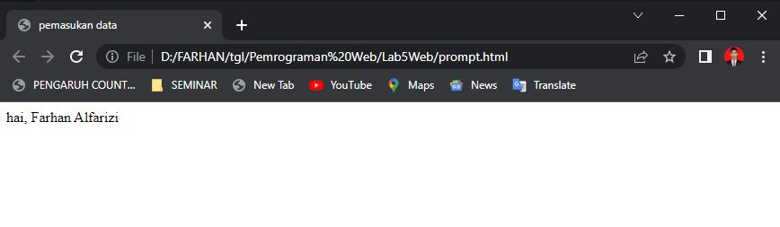

# Lab5Web
JAVASCRIPT

*Nama : Muhammad Farhan Alfarizi *
*Nim : 312010210* 
*Kelas : TI.20.B1* 

Pada praktikum kali ini saya akan menjelaskan bebera syntax HTML dengan javascript.

**Pengenalan dokument.write dan consule.log**

Langkah pertama saya membuat file baru dengan nama **Lab5Javascript.HTML** dan memberikan code HTML & Javascript.

Setelah saya menyimpan file, dan memasukan code HTML & javascript maka akan keluar tampilan seperti ini 

**Javascript Alert**

Point yang pertama saya memasukan code Javascript Alert maka akan menampilkan outpot seperti berikut

**Javascript Method**
Point yang kedua saya memasukan code Javascript Methode maka akan menampilkan outpot seperti berikut

**Promp**

Pada point promt, setelah saya masukan code maka akan menampilkan Alert untuk user memasukan nama

Setelah saya mencoba memasukan nama saya **Farhan Alfarizi** pada kolom prompt tersebut maka halam akan otomatis menampilkan seperti dibawah ini 

